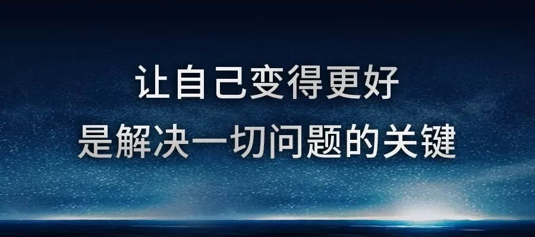

# 2019.09.02 -- {{ book.titleDesc }}第2天

## 今日推荐

技术类

[Element-UI 技术揭秘（1）- 前言](https://juejin.im/post/5d639e63e51d453b730b0f62)

[Element-UI 技术揭秘（2）- 组件库的整体设计](https://juejin.im/post/5d64fa0af265da03cd0a8e7f)

[Web Components 入门实例教程](http://www.ruanyifeng.com/blog/2019/08/web_components.html)

个人成长类

[任正非管理思想](http://www.ruanyifeng.com/blog/2019/08/ren-zhengfei.html)

## 今日鸡汤

