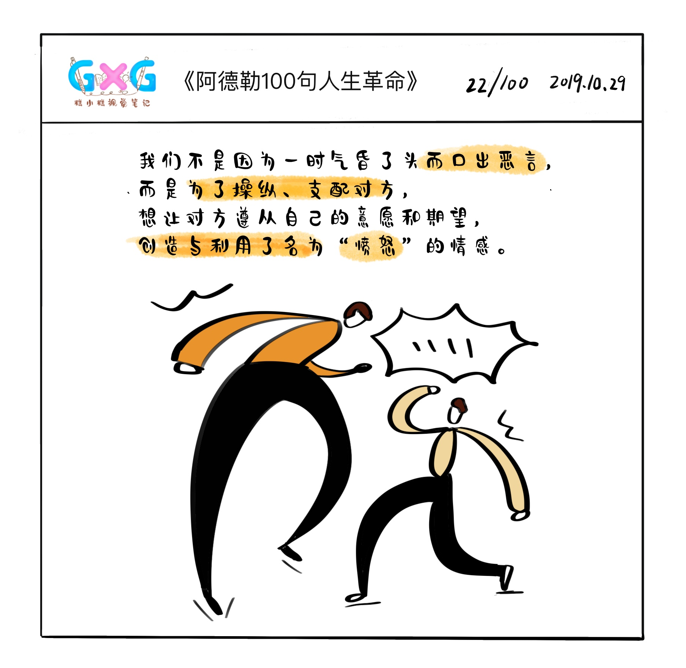

# 2019.10.30{{ book.titleDesc }}第25天

## 今日推荐

##### 技术类

目前小程序越来越普遍，小程序的框架也很多，那么，如何选择适合自己的一款小程序框架呢？今天推送的文章，对多个小程序框架进行了全面测评和比较，或许对你有帮助

[小程序多端框架全面测评](https://zhuanlan.zhihu.com/p/59764741)

 

typeScript应该是未来的趋势，现在越来越的js框架也用typeScript去写或者重写，今天推荐 typeScript奇技淫巧

[typescript 奇技淫巧](https://xin-tan.com/passages/2019-08-27-typescript-notes/)

---

##### 工具推荐

今日推荐1：推荐一个看似很炫酷，实际又没啥用的工具，爆炸输入效果，[在线演示](http://0xabcdef.com/activate-power-mode/)

[activate-power-mode](https://github.com/disjukr/activate-power-mode)

 

今日推荐2：阿里出品的，用于在React框架中快速使用动画的框架，[Motion Design](https://motion.ant.design/index-cn)

---

##### 好书推荐

好书推荐，各种互联网免费书籍，都是英文的，考验你6级的时候到了

[互联网上的免费书籍](https://github.com/ruanyf/free-books)

---

## 今日鸡汤

